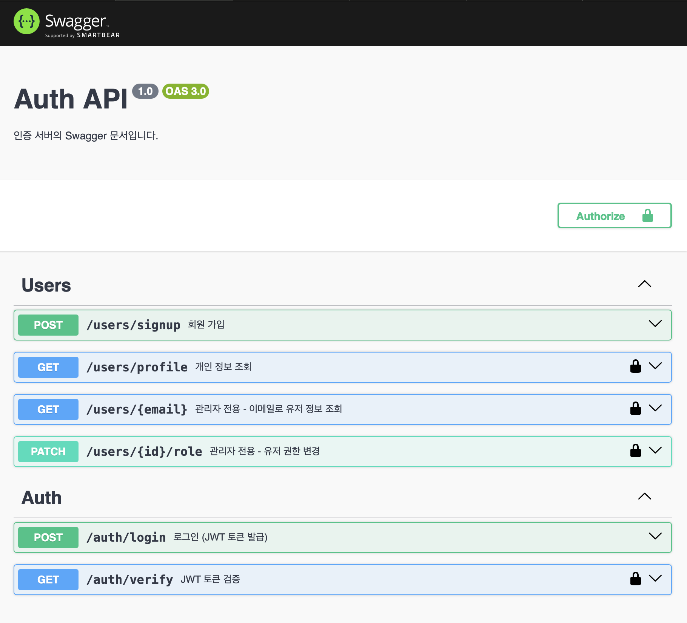
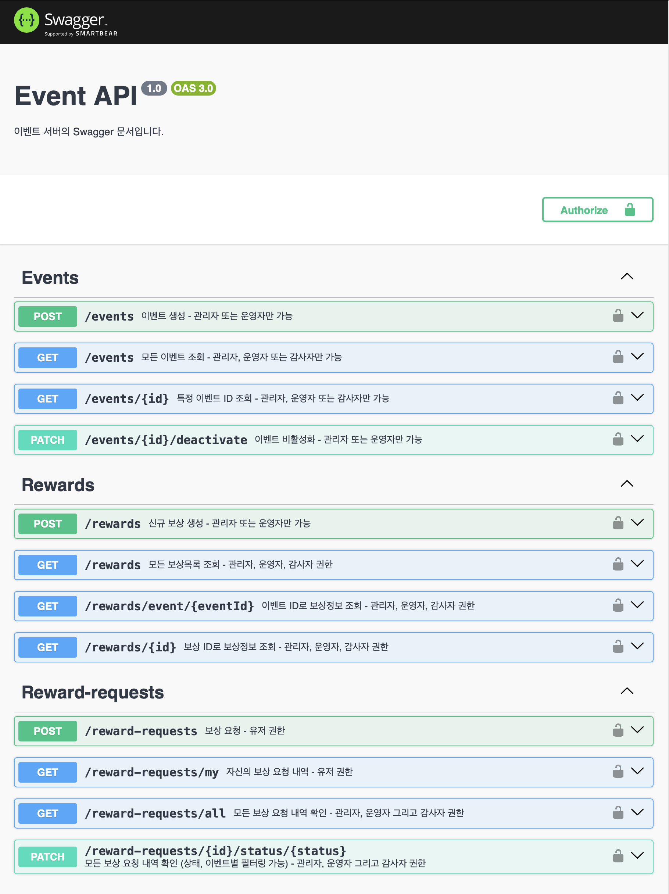
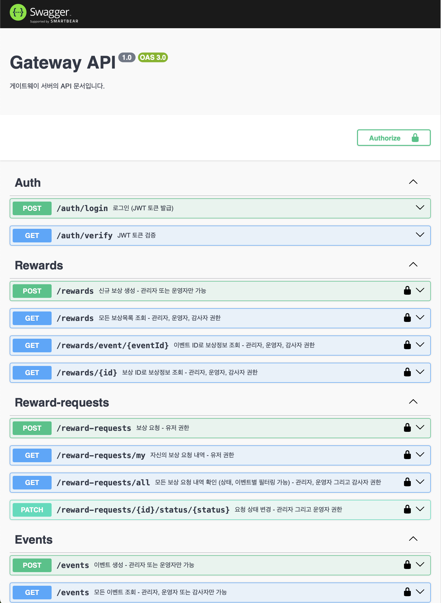

# 🎯 이벤트 / 보상 관리 플랫폼 - 백엔드 과제

## 📌 프로젝트 개요
NestJS, MongoDB, JWT, Docker를 활용한 이벤트/보상 관리 시스템입니다. 인증 및 역할 기반 권한 제어를 포함한 MSA 아키텍처 구조로 구성되었습니다.

---

## 🧱 기술 스택

| 항목         | 사용 기술               |
|--------------|------------------------|
| Language     | TypeScript             |
| Framework    | NestJS                 |
| Database     | MongoDB (Mongoose)     |
| Auth         | JWT, Passport, Guards  |
| Docs         | Swagger (OpenAPI)      |
| Container    | Docker, docker-compose |

---

## ⚙️ 서버 구조 (MSA 기반)

| 서버 이름        | 역할 설명                                     |
|------------------|----------------------------------------------|
| Gateway Server   | 모든 API 요청 진입점, 인증/권한 검사 및 라우팅 |
| Auth Server      | 회원가입, 로그인, JWT 발급, 유저 권한 관리     |
| Event Server     | 이벤트, 보상, 보상 요청 CRUD 및 상태 관리       |

---

## ✅ 구현 기능 요약

### 🧑‍💻 Auth 기능
- 회원가입 (USER로 기본 등록)
- 로그인 (JWT 발급)
- 유저 정보 조회 (본인 or 관리자)
- 유저 권한 변경 (ADMIN 전용)

### 🎉 Event 기능
- 이벤트 생성 (ADMIN, OPERATOR)
- 전체 / 단일 이벤트 조회 (ADMIN, OPERATOR, AUDITOR)
- 이벤트 비활성화 (ADMIN, OPERATOR)

### 🏆 Reward 기능
- 보상 생성 (ADMIN, OPERATOR)
- 전체 보상 목록 / 이벤트별 보상 조회
- 보상 단일 조회

### 🎁 Reward Request 기능
- 보상 요청 (USER)
- 본인 요청 내역 조회 (USER)
- 전체 요청 내역 조회 (ADMIN, OPERATOR, AUDITOR)
- 요청 상태 변경 (ADMIN, OPERATOR)

---

## 🛡️ 인증 및 권한 시스템

- JWT 기반 인증 (Passport 사용)
- `@UseGuards(JwtAuthGuard, RolesGuard)`
- `@Roles('ADMIN')` 등으로 역할 제한
- Gateway에서 인증 → 각 서비스로 토큰 전달

---

## 📦 실행 방법 (Docker 기반)

1. `.env` 파일 설정 각 서비스 디렉토리(auth_server, event_server)
    ```env
    JWT_SECRET=jwt-secret-key
    MONGODB_URI=mongodb://mongo:27017/mydb
    ```

2. Docker 실행
    ```bash
    docker-compose up --build
    ```

3. Swagger 문서 확인

| 서비스         | 포트          | Swagger 주소                    |
|--------------|--------------|--------------------------------|
| Gateway      | 3002         | http://localhost:3002/api-docs |
| Auth         | 3001         | http://localhost:3001/api-docs |
| Event        | 3000         | http://localhost:3000/api-docs |

---

## 📘 Swagger 문서 미리보기

#### 🔐 Auth 서버


#### 🎉 Event 서버


#### 🌐 Gateway 서버


---


## 📁 폴더 구조 예시

```bash
├── gateway_server
│   └── src
│       ├── auth
│       ├── proxy
│       ├── dto
│       ├── Dockerfile
│       └── main.ts
├── auth_server
│   └── src
│       ├── auth
│       ├── user
│       ├── Dockerfile
│       └── main.ts
├── event_server
│   └── src
│       ├── auth
│       ├── reward
│       ├── reward-request
│       ├── event
│       ├── Dockerfile
│       └── main.ts
├──  Docker-compose.yml
```

---

## 📌 참고 사항
- 조건 검증 로직은 간단한 예시 수준입니다 (ex: 로그인 1시간 이상)
- 삭제 API는 구현하지 않고 `isActive`를 통한 비활성화 처리
- 각 서비스는 독립된 Swagger 문서를 통해 확인 가능

---

## 💬 설계 의도
- 실무에서 활용되는 MSA 구조 및 역할 기반 보안 설계 학습 목적
- 인증/권한 검사는 Gateway에서 공통 처리, 확장성과 유지보수 용이성 확보
- 실서비스 환경을 고려한 모듈 분리 및 라우팅 구조 설계
